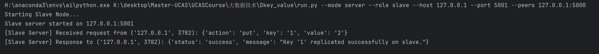
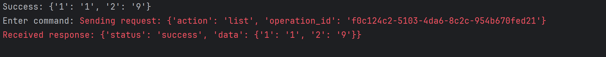

# README

分布式键值对系统

## 要求

```
1)	设计并实现键值数据的多机分布式数据存储，采用RPC（Thrift）、HTTP或者自己写Socket通信协议。
2)	支持数据的增加、修改和删除。
3)	支持记录的多副本存储。
4)	提供读写接口/检索界面访问数据存储。（以上为基本要求）
5)	支持数据写入日志或者一致性协议（利用ZK也行）模块，故障情况下实现保证可靠存储。
6)	实现单独的元数据管理。
7)	实现Bloomfilter索引或者自定义存储格式（KV）
8)	实现数据的分片存储（文档）。
9)	其他特性（以上为可选加分要求）。
```


## 初始结构

没写过，参考Github以及AI模型给出的一些项目结构，感觉挺明朗的就这个了

```
distributed_kv_store/
├── kv_store/                # 核心功能模块
│   ├── __init__.py
│   ├── store.py            # 单机键值存储实现 (基于内存或 RocksDB 等)
│   ├── replication.py      # 多副本同步逻辑
├── server/                  # 服务器实现
│   ├── __init__.py
│   ├── server.py           # 分布式节点服务端实现
│   ├── handler.py          # 请求处理逻辑
├── client/                  # 客户端工具
│   ├── __init__.py
│   ├── client.py           # 客户端实现，支持与服务端交互
├── config/                  # 配置文件
│   ├── config.yaml         # 系统配置文件
├── tests/                   # 单元测试
│   ├── test_store.py       # 测试单机存储逻辑
│   ├── test_replication.py # 测试多副本同步
│   ├── test_client.py      # 测试客户端交互
├── utils/                   # 辅助功能
│   ├── __init__.py
│   ├── network.py          # 网络通信封装 (socket)
│   ├── logger.py           # 日志工具
├── main.py                  # 主程序入口
└── README.md                # 项目说明文档

```

## 实现思路

### 基于内存的键值对功能

首先，在一番折腾下在Windows平台基本实现了一个基于内存的键值对存储系统

`server.py`


`client.py`


逻辑功能基本实现，但是由于代码是基于内存存储的，因此不满足分布式数据库的要求

调研之后准备使用`ROCKSDB`在`linux`内先实现，这段代码就先当理解下项目结构。

传到`Github`上存着先

### linux内实现

首先是`Jetbrains`家出了一个`Gateway`


外观看上去和外面的pycharm差不多，感觉不错。

#### 安装RocksDB以及其替代方案

狠活

```
git clone https://github.com/facebook/rocksdb.git
cd rocksdb
make shared_lib
make install-shared
```

干到一半：


回去重来，一大堆报错😅

冰山一角（怎么全是gtest的报错）：


最后仔细去`pypi`看了眼库的最新版本~~2020就停止维护了~~，直接放弃，不过在RockDB issue那看到了一个替代方案`Rockdict`，基于`Rust`但是有比较好的python接口。另外可能的解决办法可能包括`leveldb`和`plyvel`,到时候又出问题了再换个试试。

### 主从节点

然后到了一些代码实现环节了

首先抛开分布式的一些其他要求，要满足这四个条件：

```
1)	设计并实现键值数据的多机分布式数据存储，采用RPC（Thrift）、HTTP或者自己写Socket通信协议。
2)	支持数据的增加、修改和删除。
3)	支持记录的多副本存储。
4)	提供读写接口/检索界面访问数据存储。
```

最简单的思路莫过于写一个`client`和一个`server_master`，然后在`put`数据或者`delete`的时候呢除了`server_master`对他本地的数据库做一个操作之外还会向几个从属数据存储节点`server_slave`节点发送同样的操作，这样相当于记录就有多副本存储了，实现之后大概长这个样子：

`client`:


`server_master`


`server_slave`



总之`master`节点能和`client`节点进行一个基于`rocksdict`的简单键值对操作，但是`client`节点无法访问到`slave`节点，所以这个数据完全是没啥用的，甚至也没有数据恢复机制，就一花瓶罢了

显然，这并不是一个分布式的KV系统。

### 网状结构

也就是说`slave`节点也应该变成对等`master`节点，这样修改起来并不是很难，但是会面临一个问题：

即**环回同步（Feedback Loop）**。当节点 `A` 将数据同步到节点 `B` 时，`B` 如果再次将这个同步请求转发回 `A`，可能会导致冗余操作和一致性问题。

可以使用`uuid`的方式，添加一个uuid事务即可，此时的输出大致如下

`client`


`client2`


`server1`


`server2`


另外由于副本肯定是完全一致的,`client1`和`client2`看到的数据肯定也是一致的




虽然从两个`server`给出的你传给我我再传给你比较难蚌，但好歹基本实现了这个键值对功能。

### 进一步的改进

实现完可能称得上是的基本功能，之后需要进行一些改进。

就我直接能想到的修改部分集中在以下几点：

* 并发操控数据库的安全
* 如何实现一个同步操作（考虑使用分布式一致性算法（Raft））
* 多副本如何实现，数据不一致时如何查询数据


### CAP 定理

- 一致性： 无论连接到哪一个节点，所有的客户端在同一时间都会看到相同的数据。
- 可用性：可用性意味着任何请求数据的客户端都会得到响应，即使某些节点因故障下线。
- 分区容错性：分区表示两个节点之间的网络通信中断。分区容错性意味着，当存在网络分区时，系统仍然可以继续运行。


### 线程安全

没想到怎么操作，总之就是给`db`操作加了个🔒

### 一致性哈希

在数据量比较大场景中，把数据都存放在单个服务器明显是不可行的，我们可以进行数据分区，然后保存到多个服务器中。

为了实现高可用性和可靠性，一条数据在某个节点写入后，会复制到其他的节点，也就是我们常说的多副本。

副本数和节点数没有直接关系。副本数应该是一个可配置的参数，假如副本数为 3，同样可以借助一致性哈希环，按照顺时针找到 3 个节点，并进行存储

考虑到前面提到的基础的模块并没有对具体的查询做过多设置，只是简单的复制，所以先实现一致性哈希算法完成多副本映射以及利用一致性哈希算法完成非同步的数据读取与修改操作，存储时以访问的本地结点与哈希计算的节点为副本，并不完全同步到多个副本之中，访问时则访问哈希计算的副本即可，至于一致性哈希的参与方增加与删除作用暂时没考虑。

#### 流程展示

`client`

`list`操作为列举当前`server`的全部数据


`put 1 1`


可以看到`client1、client2`均有内容，`client3`连接的`server3`没有副本，因此没有内容


但是由于`get`操作是查询存储的服务器端`hash`映射后存储的那个服务器，因此还是可以获得内容，并且也能够对存储的内容进行修改


### 同步操作

```
Raft 算法简介
Raft 是一个领导者选举协议，它通过选举一个领导者来集中协调所有的写操作和日志复制。Raft 通过以下方式保证一致性：

领导者选举：在集群中，只有一个节点被选为领导者，所有的写请求都会先到领导者节点，然后再由领导者将日志同步到其他节点。
日志复制：领导者节点会将它的日志条目复制到其他追随者节点。所有的写操作都必须被多数节点确认，才能认为是提交成功的。
安全性：Raft 保证一旦某个日志条目被提交到集群中的大多数节点，它就会永久存在，且无法丢失。
选举与故障恢复：如果领导者节点失败，集群会通过选举机制选出新的领导者，确保集群持续可用。
```

Raft算法将分布式一致性分解为多个子问题，包括Leader选举（Leader election）、日志复制（Log replication）、安全性（Safety）、日志压缩（Log compaction）等。raft将系统中的角色分为领导者（Leader）、跟从者（Follower）和候选者（Candidate）。


因为前面史山的原因，重构一份添加`Raft`算法的实在是有点困难

然后去想一些其他的同步操作：

* 最初的构想是根据一致性的hash值，确定应该同步的数据，但这样先不考虑消耗的资源，甚至`rocksdict`都是带锁的
* 然后只能内嵌尝试用`Raft`，在原本的设计中，一致性哈希用于根据 key 来选择存储的节点，在 Raft 集群中引入一致性哈希的目的是决定如何分配每个键值对的 **“主节点”**，然后通过 Raft 保证主节点上的数据的一致性和可靠性。
* 理论上`client`连接上

最后折腾了一下大概是只能`heartbeat`没办法`store`的状态😅


### 再重构

经过一番思想斗争（~~一个人不是很想写了~~），最后还是重构了。

几个东西主要是添加`gRPC`和`Raft`算法（其实也没有实现完整，毕竟我觉得最核心的日志状态恢复功能实际上并没有做）

首先是`protos`

`raft`

```
syntax = "proto3";

package raft;

// 定义节点状态
enum NodeState {
    FOLLOWER = 0;
    CANDIDATE = 1;
    LEADER = 2;
}

// 日志条目结构
message LogEntry {
    string action = 1;  // 例如, PUT、DELETE 等操作
    string key = 2;
    string value = 3;
    string operation_id = 4;
    int32 term = 5;
}


// RequestVote RPC 请求
message RequestVoteRequest {
    int64 term = 1;  // 请求者的任期
    string candidate_id = 2;  // 候选者的ID
    int64 last_log_index = 3;  // 候选者最后一个日志条目的索引
    int64 last_log_term = 4;   // 候选者最后一个日志条目的任期
}

message RequestVoteResponse {
    int64 term = 1;  // 当前任期
    bool vote_granted = 2;  // 是否投票给该候选者
}

// AppendEntries RPC 请求
message AppendEntriesRequest {
    int64 term = 1;  // 领导者的任期
    string leader_id = 2;  // 领导者ID
    int64 prev_log_index = 3;  // 前一个日志条目的索引
    int64 prev_log_term = 4;   // 前一个日志条目的任期
    repeated LogEntry entries = 5;  // 日志条目列表
    int64 leader_commit = 6;  // 领导者提交日志的索引
}

message AppendEntriesResponse {
    int64 term = 1;  // 当前任期
    bool success = 2;  // 是否成功复制日志
}

// Heartbeat RPC 请求
message HeartbeatRequest {
    int64 term = 1;  // 当前任期
}

message HeartbeatResponse {
    int64 term = 1;  // 当前任期
}

// 定义Raft服务
service RaftService {
    // 请求投票
    rpc RequestVote(RequestVoteRequest) returns (RequestVoteResponse);

    // 追加日志条目
    rpc AppendEntries(AppendEntriesRequest) returns (AppendEntriesResponse);

    // 发送心跳
    rpc Heartbeat(HeartbeatRequest) returns (HeartbeatResponse);
}

```

使用起来比较神奇

` python -m grpc_tools.protoc --proto_path=. --python_out=. --grpc_python_out=. ./raft.proto`

总之调用起来确实比原来乱封装的`socket`好用不少

然后是`Raft`算法部分

来来去去主要是实现了两个部分，一个是投票确定`leader`,一个是`log`

* 首先启动Raft节点会经过term 0开始选举：


* 然后当你启动与他连接的其他Raft节点时，会收到来自`leader`的`heartbeat`：
  

* 杀掉原来的`leader`，会触发重新选举

  

  

  不过会一直报连接不到的错，因为也没有去做动态加入或者剔除的机制（反正能跑，问题不大）


关于`log`记录，则是在每次对数据库做一些修改的时候会做本地的记录，也很简单，然后通过`Raft`节点发送过去然后同步到本地。至于什么差异检测与状态恢复，只能说是没什么时间也没啥继续的想法去实现了。

重构的部分还在`servernode`和`datanode`节点这，原来他们是合一的，每个`node`同时接受数据和存储数据，但这样的话添加完一致性哈希之后就会很奇怪（某些节点有数据，某些节点没数据，但是又能看见数据）而且说实话就没有什么必要去什么一致性

所以又把`servernode`和`datanode`拆开，`datanode`完全依赖于`servernode`，`servernode`单独去做一个`leader`或者`follower`，`client`只能访问`leader`(感觉上面可以再包一层，自动定位到当前的`leader`)，`datanode`内部有一个`hash`环，然后通过`hash`算法算出应当存储的节点和下一个节点作为副本。

Q:然后再次思考，多副本感觉实在是没啥用？

A:所以最后在`servernode`进行查询操作的时候，可以同时查询存储的副本，然后比较，校验存储的一致性（~~太实用了~~）

所以最后的结构图如下：


图先欠着


## 总结

通过本次xx，我学会了xx,也让我在之后的学习生活中xx
